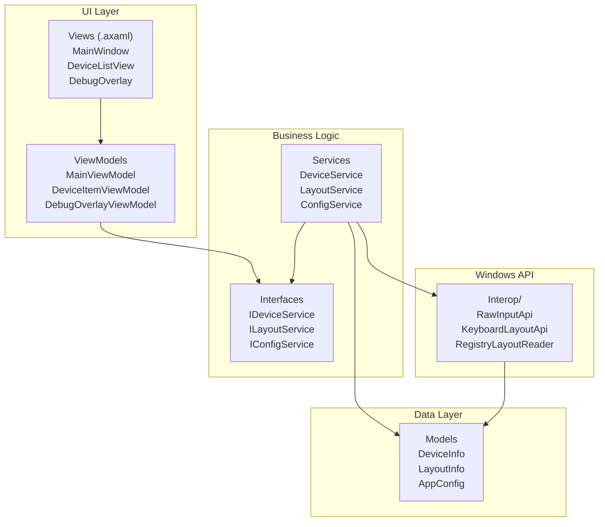
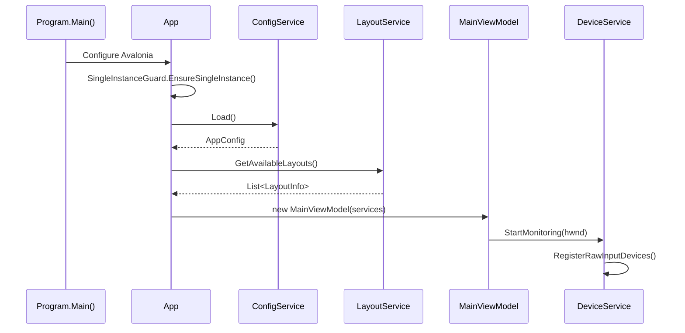
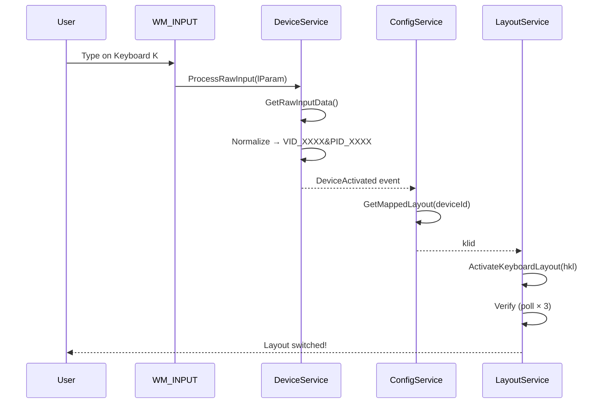

# Architecture

SwitchcraftKeys follows a layered architecture with strict dependency rules to ensure testability and maintainability.

## Core Principles

1. **Device-centric model** — users think in devices, not layouts
2. **Deterministic behavior** — no hidden heuristics, explicit mappings
3. **No Win32 outside Interop/** — all P/Invoke calls isolated in one layer
4. **Views know only ViewModels** — no business logic in code-behind
5. **Services testable via interfaces** — Interop layer mockable in tests
6. **Graceful degradation** — errors logged and recovered, never crash

## Layer Diagram



## Dependency Rules

| Layer | Can Depend On |
|-------|---------------|
| Views | ViewModels only |
| ViewModels | Service interfaces only (no `new DeviceService()`) |
| Services | Interop + Models |
| Interop | Zero application dependencies |
| Models | Zero dependencies |

## Directory Structure

```
src/SwitchcraftKeys/
├── Program.cs                    Entry point, CLI parsing
├── App.axaml + App.axaml.cs     Application shell, DI setup
│
├── Assets/
│   ├── icon.ico
│   └── Themes/
│       ├── LunaTheme.axaml      Color tokens, brushes
│       └── LunaControls.axaml   Control style overrides
│
├── Models/
│   ├── DeviceInfo.cs            DeviceId, Alias, AssignedLayoutKlid
│   ├── LayoutInfo.cs            Klid, DisplayName, LanguageCode, Hkl
│   └── AppConfig.cs             Devices dictionary, UiSettings
│
├── ViewModels/
│   ├── MainViewModel.cs         Dashboard state, commands
│   └── DebugOverlayViewModel.cs Live debug data
│
├── Views/
│   ├── MainWindow.axaml         Dashboard UI
│   └── DebugOverlayWindow.axaml Floating debug window
│
├── Services/
│   ├── Interfaces/              Service contracts
│   ├── DeviceService.cs         Raw Input processing
│   ├── LayoutService.cs         Registry + HKL switching
│   └── ConfigService.cs         JSON persistence
│
└── Interop/
    ├── NativeStructs.cs         RAWINPUT, RAWINPUTDEVICE
    ├── NativeConstants.cs       WM_INPUT, RIDEV_INPUTSINK
    ├── RawInputApi.cs           P/Invoke for Raw Input
    ├── KeyboardLayoutApi.cs     P/Invoke for layout APIs
    └── RegistryLayoutReader.cs  HKLM layout enumeration
```

## Data Flow

### Application Startup



### Keystroke → Layout Switch



## Service Interfaces

### IDeviceService

```csharp
public interface IDeviceService
{
    event EventHandler<DeviceActivatedEventArgs> DeviceActivated;
    IReadOnlyList<DeviceInfo> GetConnectedDevices();
    Task StartMonitoringAsync(IntPtr windowHandle);
    void StopMonitoring();
}
```

### ILayoutService

```csharp
public interface ILayoutService
{
    IReadOnlyList<LayoutInfo> GetAvailableLayouts();
    LayoutInfo? GetCurrentLayout();
    Task<bool> SwitchLayoutAsync(string klid);
}
```

### IConfigService

```csharp
public interface IConfigService
{
    AppConfig Load();
    void Save(AppConfig config);
    string? GetMappedLayoutKlid(string deviceId);
    void AssignLayout(string deviceId, string klid);
    void SetDeviceAlias(string deviceId, string alias);
    void EnsureDeviceExists(string deviceId);
}
```

## Performance Targets

| Metric | Target | Rationale |
|--------|--------|-----------|
| Startup (devices enumerated) | < 2 seconds | User shouldn't wait |
| Layout switch (end-to-end) | < 500 ms | Imperceptible delay |
| Raw Input hook latency | < 1 ms | No keystroke lag |
| Idle CPU | < 1% | Background app |
| Memory | < 50 MB | Lightweight tool |
| Binary size | < 15 MB | Quick download |

## Error Handling

| Severity | Example | Action |
|----------|---------|--------|
| Info | Layout switched OK | Log only |
| Warning | Layout switch took >500ms | Log + status message |
| Error (recoverable) | Layout not found | Remove from config, notify |
| Error (recoverable) | Config corrupted | Restore from backup |
| Fatal | Mutex acquire fails | Show message, exit |

All service methods return `bool` / `Task<bool>` or use Result-style patterns. No unhandled exceptions.

---

Next: [Windows Interop](windows-interop) | [Design Decisions](design-decisions)
