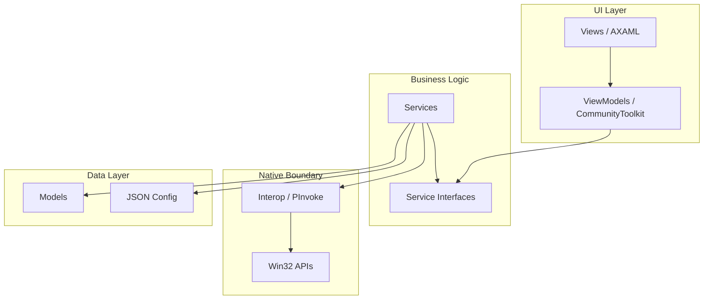
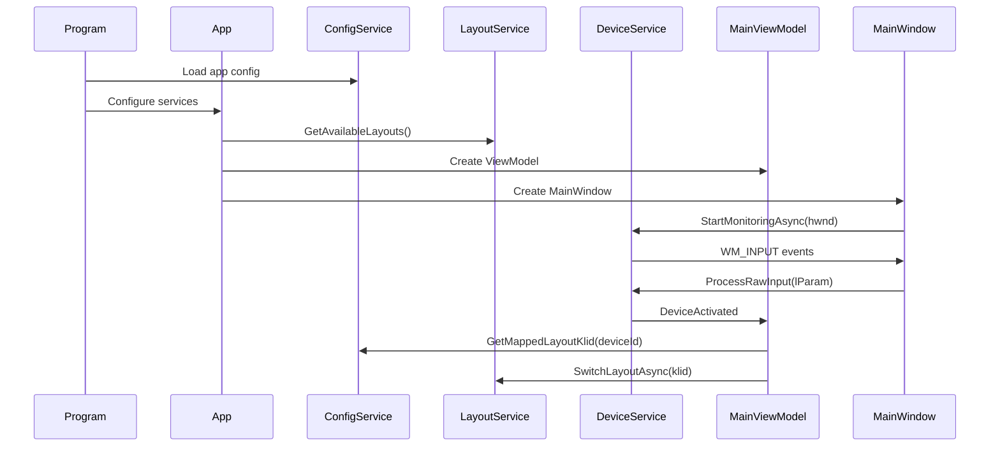
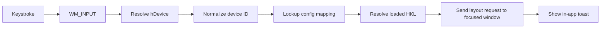
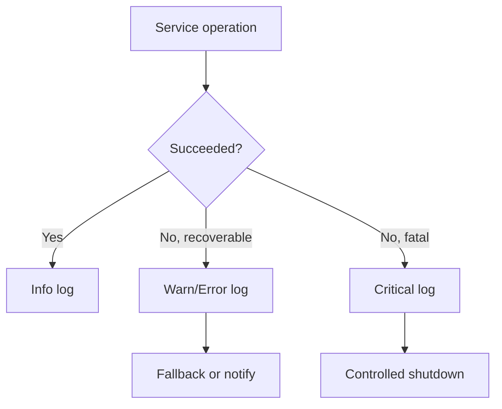

# Architecture

SwitchcraftKeys follows a layered architecture with strict dependency rules to keep UI, services, and Win32 interop testable.

## Core Principles

1. **Device-centric model** - users think in keyboards, not layout handles.
2. **Deterministic behavior** - no hidden heuristics, explicit mappings only.
3. **No Win32 outside Interop** - P/Invoke stays isolated.
4. **Views know only ViewModels** - no business logic in code-behind.
5. **Services depend on interfaces** - testable through mocks.
6. **Graceful degradation** - log and recover where possible.

## Layer Diagram



## Dependency Rules

| Layer | Can Depend On | Must Not Depend On |
|-------|---------------|--------------------|
| Views | ViewModels | Services, Interop |
| ViewModels | Service interfaces, Models | Concrete services, Win32 |
| Services | Interfaces, Models, Interop | Avalonia UI types |
| Interop | Native structs/constants | App services/UI |
| Models | Nothing app-specific | UI/Services/Interop |

## Runtime Flow



## Device Activation Flow



## Service Interfaces

```csharp
public interface IDeviceService
{
    event EventHandler<DeviceActivatedEventArgs> DeviceActivated;
    IReadOnlyList<DeviceInfo> GetConnectedDevices();
    Task StartMonitoringAsync(IntPtr windowHandle);
    void StopMonitoring();
}

public interface ILayoutService
{
    IReadOnlyList<LayoutInfo> GetAvailableLayouts();
    LayoutInfo? GetCurrentLayout();
    Task<bool> SwitchLayoutAsync(string klid);
}
```

## Error Handling


