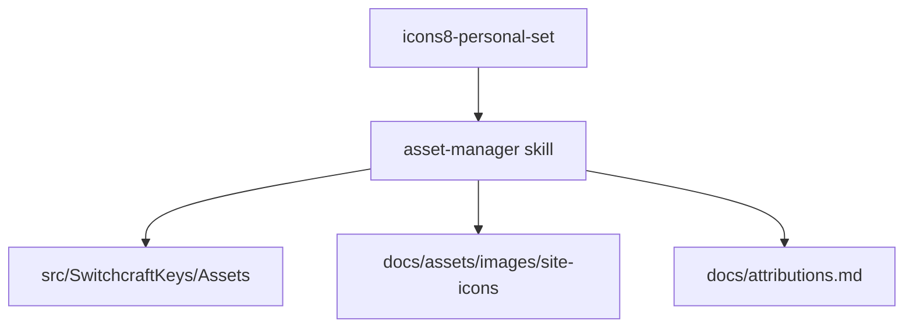

# Assets Guide

SwitchcraftKeys uses local PNG assets for Avalonia UI and the documentation site.

## Asset Flow



## App Asset Structure

```text
src/SwitchcraftKeys/Assets/
├── icon.ico
├── Icons/
├── Themes/
└── Views/
    └── MainWindow/
```

## Naming

| Context | Pattern | Example |
|---------|---------|---------|
| App view icon | `{ViewName}-{descriptor}-{size}.png` | `MainWindow-settings-32.png` |
| Site feature icon | `feature-{descriptor}-100.png` | `feature-keyboard-100.png` |
| Shared app icon | `{descriptor}-{size}.png` | `keyboard-32.png` |

## Size Guide

| Context | Size |
|---------|------|
| Inline status | 16px |
| Buttons/toolbars | 32px |
| Dialog/action cards | 48px / 50px |
| Site feature cards | 100px |

## Avalonia Reference

```xml
<Image Source="avares://SwitchcraftKeys/Assets/Views/MainWindow/MainWindow-settings-32.png"
       Width="32" Height="32" />
```

## Rules

| Do | Avoid |
|----|-------|
| Use PNG from the personal icon set | Converting `.ico` to PNG |
| Update attributions | Untracked copied icons |
| Keep app and site assets separate | Hardcoded random paths |
