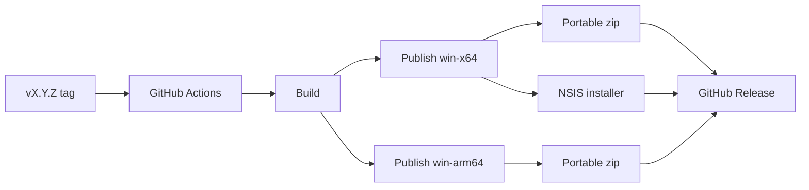

# Build Scripts

All scripts run from the repository root with PowerShell 7+.

## Commands

| Script | Purpose |
|--------|---------|
| `build/build.ps1` | Compile app/tests |
| `build/test.ps1` | Run xUnit tests |
| `build/build-release.ps1` | Publish zip and optional installer |
| `build/check.ps1` | Run health check through built app |
| `build/clean.ps1` | Remove build outputs |

## Release Pipeline



## Local Release

```powershell
./build/build.ps1 -Config Release -Release
./build/build.ps1 -Config Release -Release -Installer
```
