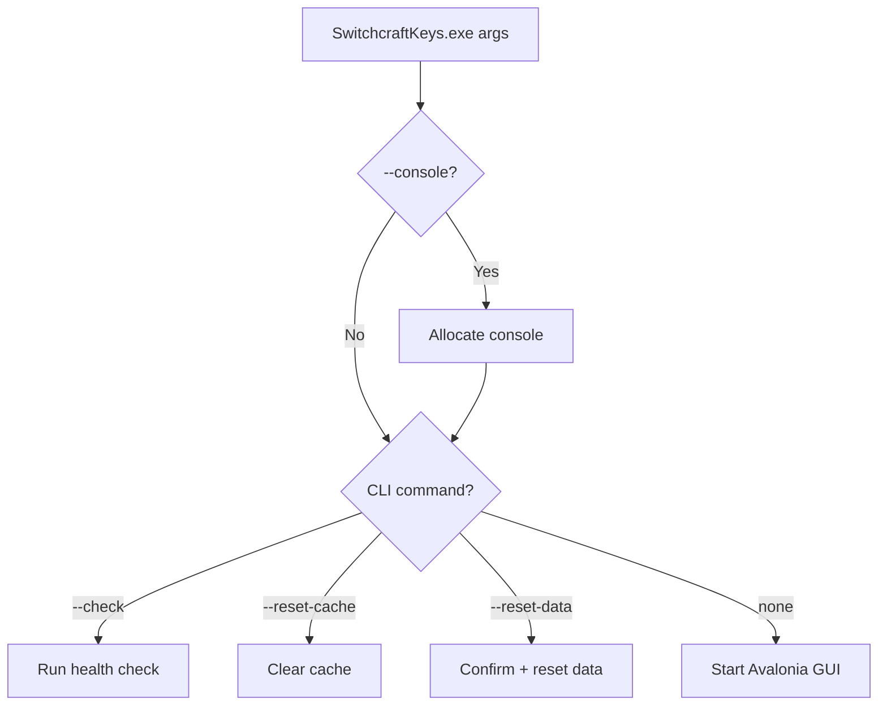

# CLI Reference

SwitchcraftKeys is a GUI app, but supports diagnostic CLI flags.

## Options

| Option | Action |
|--------|--------|
| `--help`, `-h`, `-?` | Show help |
| `--version`, `-v` | Print version |
| `--check` | Run health check |
| `--reset-cache`, `-c` | Clear cache |
| `--reset-data`, `-r` | Reset config, cache, and logs |
| `--console` | Force-open a diagnostics console for GUI logging |

## Flow



## Examples

```powershell
SwitchcraftKeys --check
SwitchcraftKeys --console
SwitchcraftKeys --reset-cache
```
