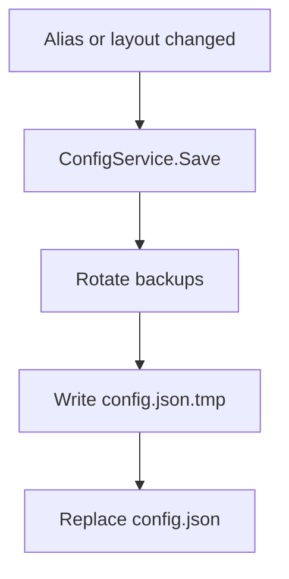
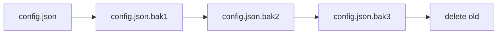
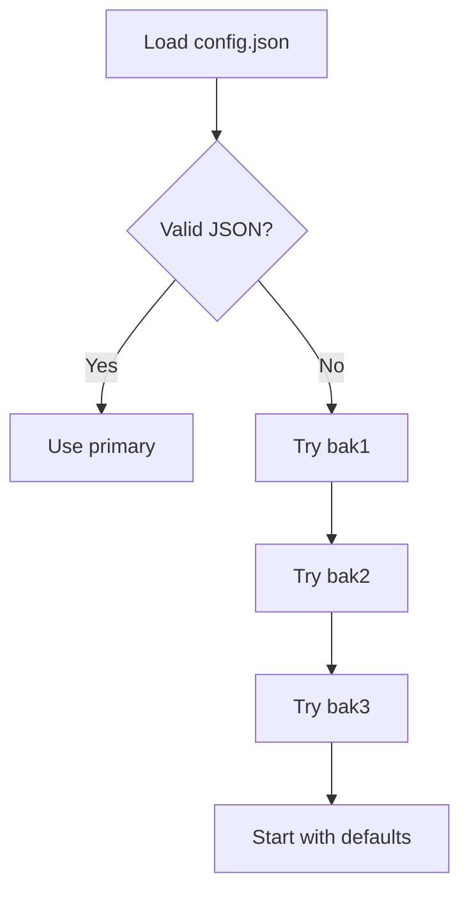

# Config & Backup

Config is local, per-user, and automatically saved.

## Location

```text
%APPDATA%\SwitchcraftKeys\config.json
```

## Schema

```json
{
  "version": 1,
  "devices": {
    "VID_046D&PID_B380": {
      "alias": "LOGI MX2",
      "layoutKlid": "040A0C0A"
    }
  },
  "logging": {
    "minimumLevel": "Trace"
  },
  "ui": {
    "startMinimized": true
  }
}
```

## Save Flow



## Backup Rotation



## Recovery


