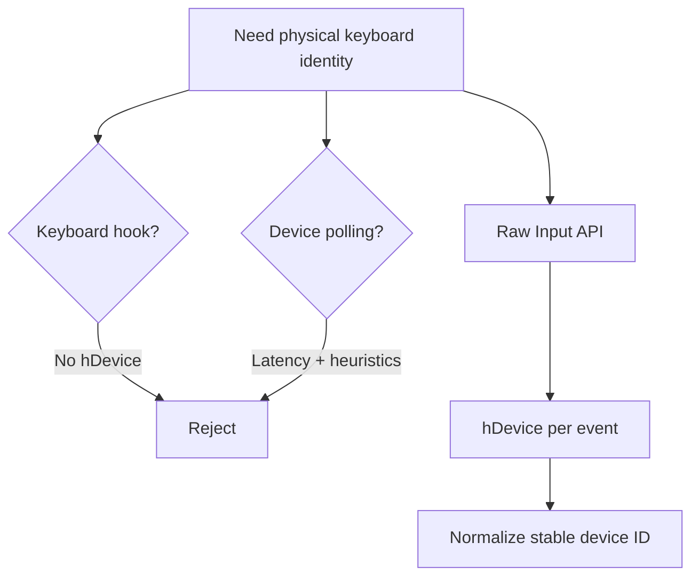
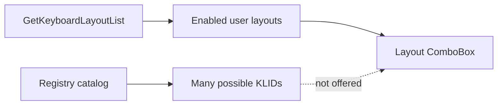
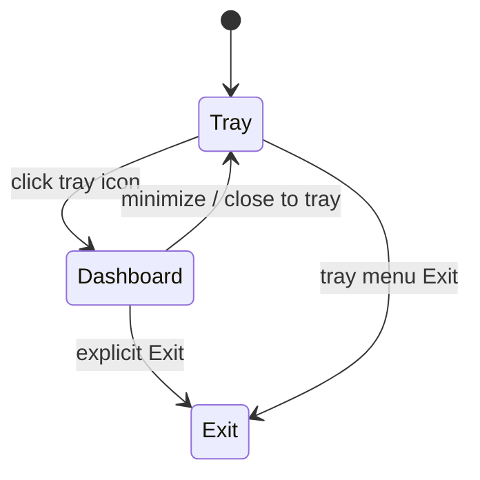

# Design Decisions

These decisions keep the app small, deterministic, and testable.

## Summary

| Area | Decision |
|------|----------|
| Device identity | USB uses `VID_XXXX&PID_XXXX`; built-in uses `BUILTIN` |
| Detection | Raw Input, not polling or keyboard hooks |
| Layout source | Loaded layouts from `GetKeyboardLayoutList()` |
| Persistence | JSON in `%APPDATA%\SwitchcraftKeys` |
| UI model | Tray-first dashboard |
| Native calls | P/Invoke isolated under `Interop/` |

## Why Raw Input

## Why Loaded Layouts Only

The registry lists every layout Windows knows about. Users can only switch to layouts installed/enabled in their profile/session.

## Why Tray-First

SwitchcraftKeys runs in the background and reacts to keystrokes. Dashboard is configuration, not primary daily workflow.

