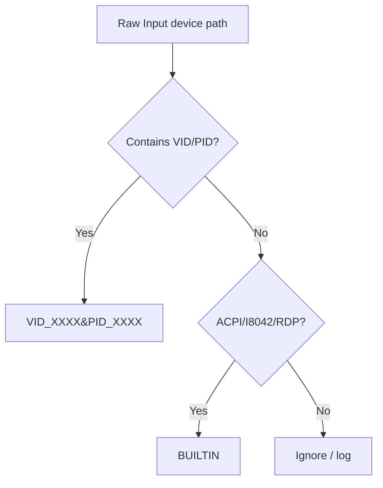

# Device Detection

SwitchcraftKeys normalizes noisy Raw Input paths into stable device IDs.

## Normalization Flow

## ID Formats

| Device | ID | Example |
|--------|----|---------|
| USB keyboard | `VID_XXXX&PID_XXXX` | `VID_046D&PID_C31C` |
| Bluetooth HID | `VID_XXXX&PID_XXXX` when exposed | `VID_046D&PID_B380` |
| Built-in laptop | `BUILTIN` | `BUILTIN` |

## Trade-Offs

Two identical keyboards from the same vendor/model may share VID/PID. Future versions can include instance suffixes if needed.
