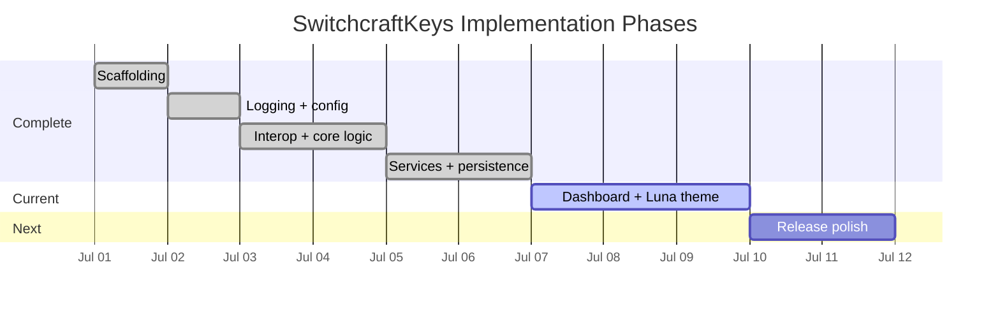

# Implementation Plan

## Phase Status

## Checklist

| Phase | Status | Scope |
|-------|--------|-------|
| 0 | Complete | Solution, projects, scripts |
| 0.5 | Complete | Logging, config, preflight |
| 1 | Complete | Raw Input and layout interop |
| 2 | Complete | Services, config, single instance |
| 3 | In progress | Dashboard, tray, settings, toasts |
| 4 | Planned | Docs, screenshots, release polish |

## Implementation Rule

Keep each phase runnable. Avoid large refactors while porting core behavior.
