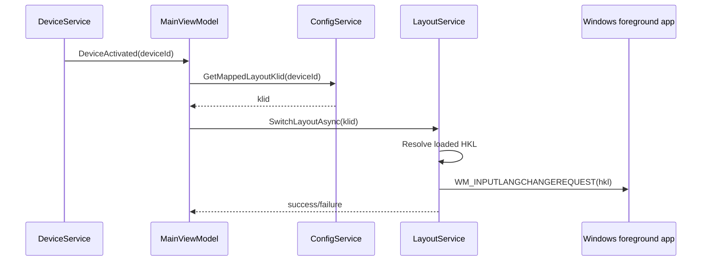
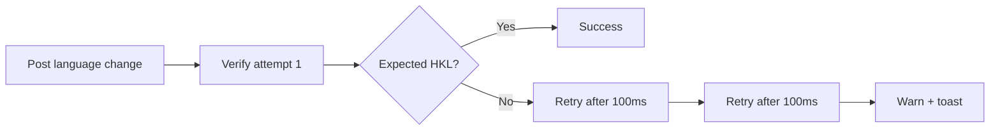

# Layout Switching

When a keyboard becomes active, SwitchcraftKeys applies the configured layout to the focused Windows app.

## Switching Pipeline

## Loaded HKL First

`GetKeyboardLayoutList()` returns layouts enabled in the current Windows session. SwitchcraftKeys uses those HKLs directly, because variant HKLs such as `040A0C0A` may not map 1:1 with registry KLID names.

## Verification

