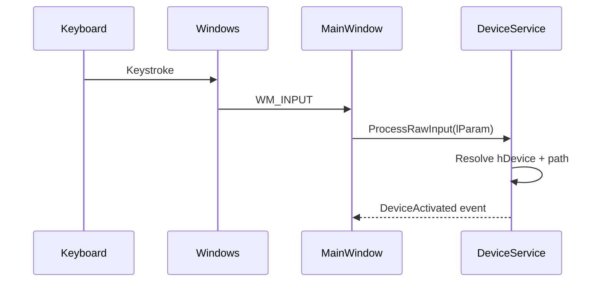

# Raw Input API

Raw Input is the foundation of device-aware layout switching.

## Message Flow



## Registration

The app registers for keyboard input with `RIDEV_INPUTSINK`, so it receives device-origin messages while in the tray.

```csharp
var rid = new RAWINPUTDEVICE
{
    UsagePage = 0x01,
    Usage = 0x06,
    Flags = RIDEV_INPUTSINK,
    Target = hwnd,
};
```

## Why Not Hooks

| Mechanism | Device identity | Notes |
|-----------|-----------------|-------|
| `WH_KEYBOARD_LL` | No | Can see keys, not physical keyboard |
| Polling | No reliable event origin | Expensive and heuristic-heavy |
| Raw Input | Yes | Provides `hDevice` per event |
