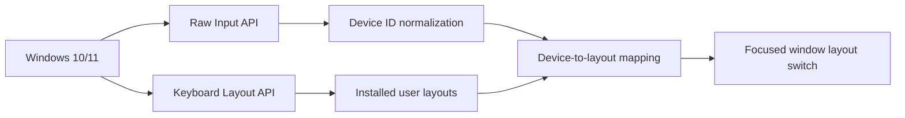

# Requirements

SwitchcraftKeys is a Windows desktop utility built around Win32 Raw Input and keyboard layout APIs.

## Runtime Requirements

| Requirement | Version | Notes |
|-------------|---------|-------|
| Windows | 10 / 11 | Raw Input + input language APIs |
| Architecture | x64 / arm64 | CI builds both artifacts |
| Runtime | .NET 8 | Framework-dependent local builds; release can publish self-contained |
| Privileges | Standard user | No administrator rights required |

## Capability Matrix



## Development Requirements

| Tool | Use |
|------|-----|
| .NET SDK 8.0+ | Build and tests |
| PowerShell 7+ | Build scripts |
| NSIS | Optional installer build |
| Ruby/Bundler | Optional local Jekyll docs build |

## Windows Settings Requirement

For deterministic behavior, enable shared input method behavior in Windows:

```powershell
Set-ItemProperty `
  -Path "HKCU:\Control Panel\International\User Profile" `
  -Name "EnablePerProcessInputMethod" `
  -Type DWord `
  -Value 0
```

The app exposes this as **Settings → Windows input method scope → Use shared**.

## Constraints

| Constraint | Reason |
|------------|--------|
| Windows-only core | Raw Input and HKL are Win32-specific |
| Layouts must be installed | Only loaded layouts from `GetKeyboardLayoutList()` are offered |
| Bluetooth device identity may vary | Some Bluetooth HID paths expose custom identifiers |
