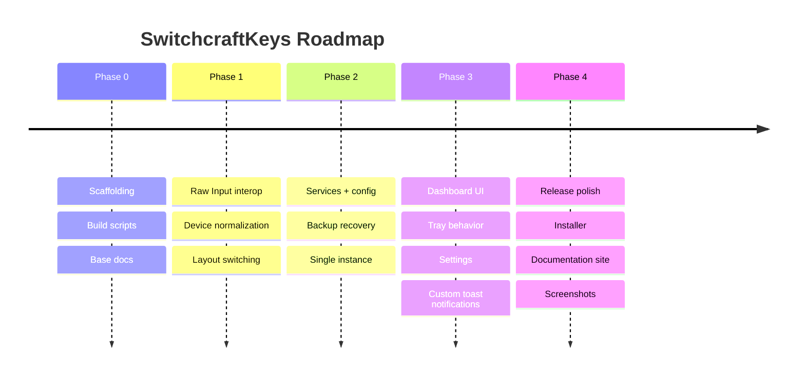

# Roadmap

SwitchcraftKeys is currently focused on a polished Windows tray-first experience.

## Current Phase

## Planned Work

| Area | Candidate Work |
|------|----------------|
| UX | Autostart toggle, first-run guide, richer tray menu |
| Layout switching | Optional broadcast mode, better foreground-app diagnostics |
| Device detection | Improved Bluetooth naming, identical-keyboard disambiguation |
| Observability | Export logs, health report bundle |
| Packaging | Installer validation, portable upgrade docs |

## Not Planned Soon

| Feature | Why |
|---------|-----|
| macOS/Linux | Core behavior depends on Win32 APIs |
| Key remapping | Different product scope |
| Cloud sync | Personal utility; config is local-first |
