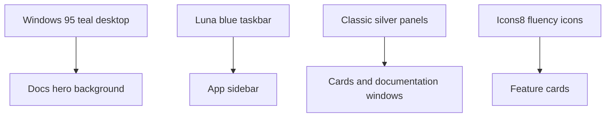

# Luna Theme

The visual style blends Windows XP Luna controls with Windows 95 teal desktop color.

## Palette

| Token | Color | Use |
|-------|-------|-----|
| Teal desktop | `#008080` | Site hero and desktop accents |
| Teal dark | `#005C5C` | Navigation and top gradients |
| Luna blue | `#245EDC` | App sidebar and primary focus |
| Luna silver | `#ECE9D8` | Window backgrounds |
| Luna green | `#3C9A42` | Success/action state |

## Visual System

## UI Rules

| Rule | Reason |
|------|--------|
| Prefer flat teal/blue gradients | Keeps retro Windows identity |
| Use white content cards | High readability |
| Avoid fake window buttons unless interactive | Less visual clutter |
| Use icons over emoji | Consistent app/site language |
