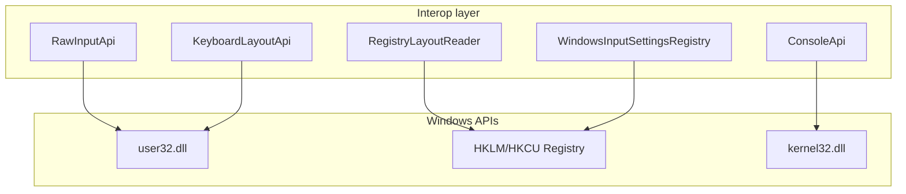
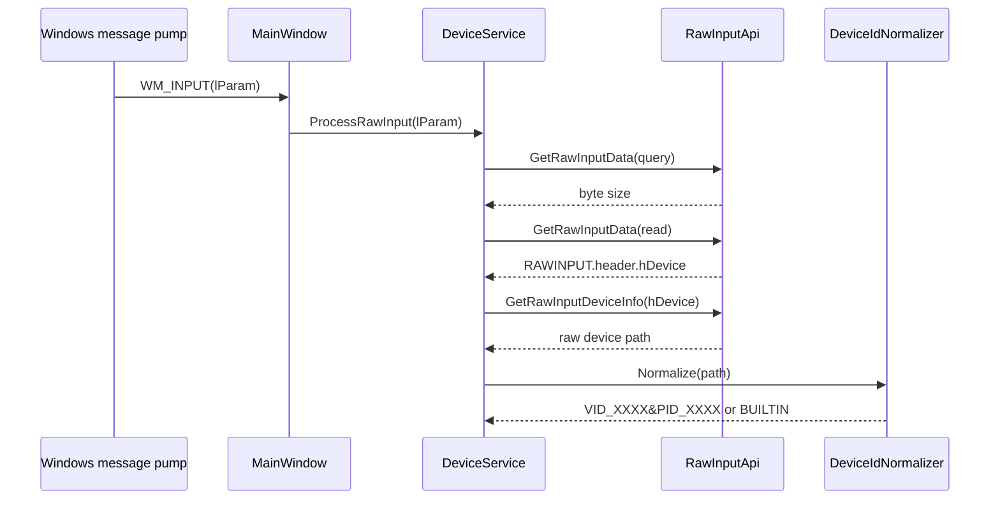
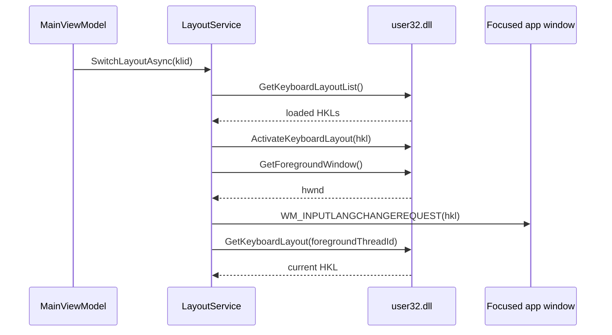

# Windows Interop

All native calls live in `src/SwitchcraftKeys/Interop/`. No ViewModel or Service owns `[DllImport]` declarations directly.

## Interop Map

## Raw Input

Raw Input identifies which physical keyboard generated a keystroke.

## Layout Switching

Keyboard layouts are per thread/window in Windows. SwitchcraftKeys applies the configured HKL to the focused window.

## Registry Usage

| Path | Purpose |
|------|---------|
| `HKLM\SYSTEM\CurrentControlSet\Control\Keyboard Layouts` | Friendly layout names |
| `HKCU\Control Panel\International\User Profile` | Per-app input method toggle |

## Native Boundaries

